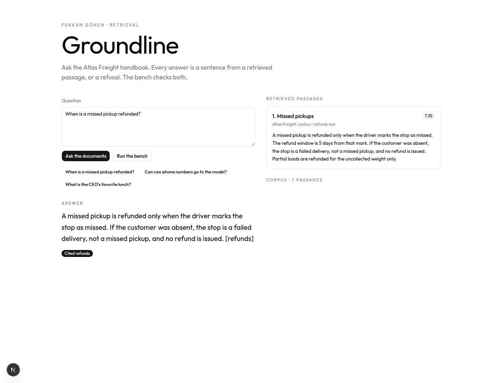
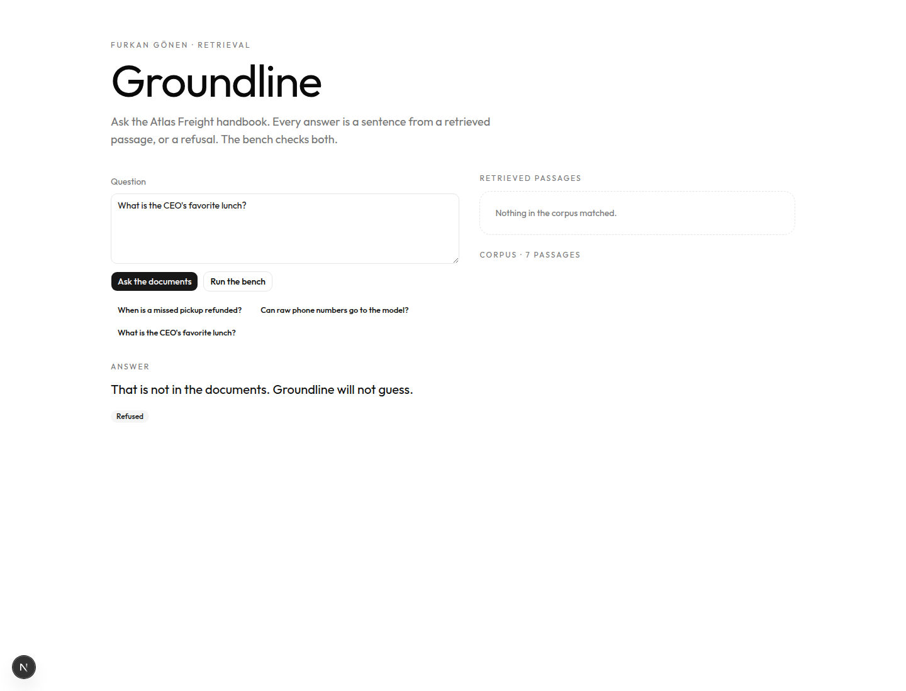
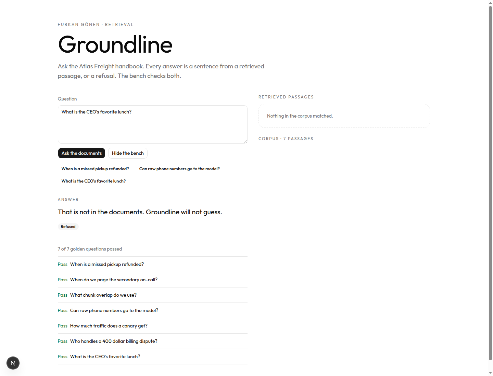

# Groundline

Groundline answers questions about a company handbook. It shows the passage it used. If the handbook does not contain the fact, it refuses.

There is no API key. Retrieval is BM25. The answer is a sentence copied from the winning passage, tagged with that passage’s id. A bench of seven questions checks both the citations and the refusal.

## A cited answer

Ask “When is a missed pickup refunded?” The score on **Missed pickups** is 4.78. The reply is taken from that file and marked `[refunds]`. The other passages stay visible, with lower scores, so you can see why they lost.



## A refusal

Ask something the handbook never says, such as the CEO’s favorite lunch. Groundline does not invent a meal. It says the fact is not in the documents.



## The bench

Seven fixed questions. Six must cite the right passage. One must be refused. In this run, seven of seven passed.



## How it works

1. `src/lib/corpus.ts` is the handbook: refunds, on-call, chunking, phone numbers, canaries, billing, and the refusal rule.
2. `src/lib/retrieve.ts` ranks those passages with BM25.
3. `src/lib/answer.ts` stops when the best score is weak. Otherwise it quotes the sentences that share words with the question.
4. `src/lib/evalset.ts` is the bench. `npm test` runs it.

## Run

```bash
npm install
npm test
npm run dev -- --port 43127
```

A chat box that invents an answer looks finished and is not. Groundline shows what was retrieved, what was cited, and what was refused. That is the part of a retrieval system you can defend in an interview.
